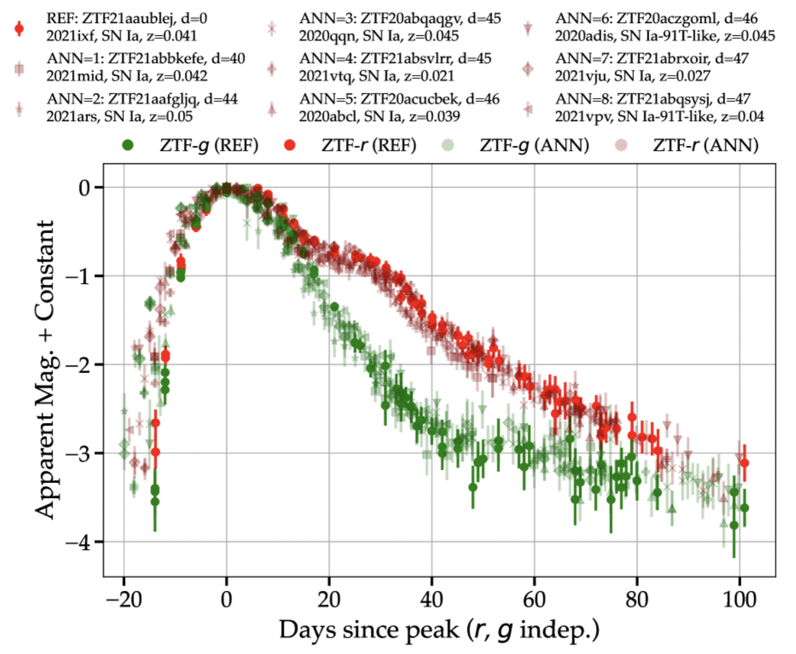

# Time-Domain Needles in Rubin's Haystack: Feature-Based Anomaly Detection and Similarity Search of Supernova.

Notebooks to be used as a starting point for supernova similarity searches and tagging of _photometric_ and _contextual_ anomalies. Uses data from the Zwicky Transient Facility as served by the ALeRCE and ANTARES alert brokers. Based on the model and code from [Aleo et al., 24](https://arxiv.org/html/2404.01235v1).

- [Notebook 1](./notebooks/01_laiss_demo.ipynb): The broad overview of the code and how it works. Future notebooks to come expanding LAISS's functionality!

